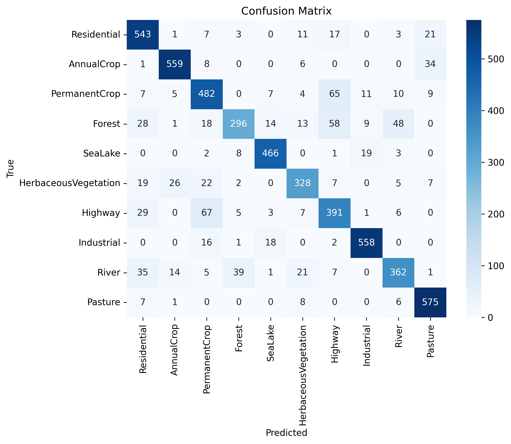

# Eurosat-landcover-classification
This project implements an end-to-end machine learning baseline for
satellite image classification using the EuroSAT RGB dataset.

## Problem Statement
Classify satellite images into land-use and land-cover categories such as
Forest, Residential, Industrial, Sea/Lake, etc.

## Dataset
- Source: EuroSAT RGB Dataset
- Number of classes: 10
- Image size: 64×64 RGB

## Methodology
- Image preprocessing using OpenCV
- Train–test split with stratification
- Convolutional Neural Network (CNN) baseline
- Evaluation using accuracy and classification metrics

## Results
- Achieved strong baseline accuracy on unseen test images
- Model successfully predicts land-cover class for individual satellite images

## Demo
📌 *Google Colab Demo:*
📌 **Google Colab Demo:**  
[Click here to open the Colab notebook](https://colab.research.google.com/drive/1w3i9AfXT4pQOuIQ5W-QTOqoRwxUsg5r3?usp=sharing)
## Confusion Matrix




## How to Run
```bash
pip install -r requirements.txt
